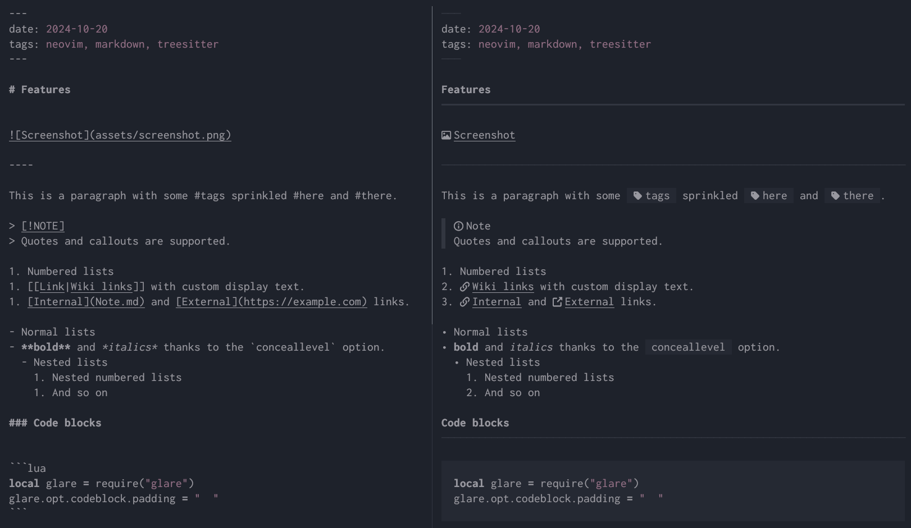

<div align="center">
    <h1>glare.nvim</h1>
    
    <p></p>
    <p>Very opinionated markdown rendered.</p>
</div>



## Requirements

A [patched font](https://www.nerdfonts.com/) for icons support.

[nvim-treesitter](https://github.com/nvim-treesitter/nvim-treesitter) with the `markdown` and `markdown_inline` parsers installed.

```lua
require("nvim-treesitter.configs").setup({
    ensure_installed = {
        "markdown",
        "markdown_inline",
    },
    sync_install = true,
    ...
})
```

## Enabling Tags and Wiki Links support

To enable support for [tags](https://help.obsidian.md/Editing+and+formatting/Tags) and [wiki links](https://help.obsidian.md/Linking+notes+and+files/Internal+links) you need to build the `markdown_inline` parser by yourself with the right [extension](https://github.com/tree-sitter-grammars/tree-sitter-markdown?tab=readme-ov-file#extensions) enabled. The `tree-sitter` command line tool and `node.js` must be installed first:

```sh
$ git clone https://github.com/tree-sitter-grammars/tree-sitter-markdown/
$ cd tree-sitter-markdown/tree-sitter-markdown-inline
$ ALL_EXTENSIONS=1 tree-sitter generate
$ tree-sitter build --output markdown_inline.so .
$ cp markdown_inline.so /your/parser/directory
```

Also be sure to have your [parser directory](https://github.com/nvim-treesitter/nvim-treesitter?tab=readme-ov-file#changing-the-parser-install-directory) come before anything else in your `runtimepath`:

```lua
vim.opt.runtimepath:prepend("/custom/parsers/directory")
```

Then check with following command:

```vim
:for p in nvim_get_runtime_file('parser/*.so', v:true) | echo p | endfor
```

Your custom parsers must appear before any parser bundled by default with *Neovim*.

## Usage

Rendering is done as soon as you open a markdown file. Use the `:Glare` command to toggle rendering for the current buffer.

## Colors

- `GlareCodeblockBg` Code block background.
- `GlareCodeinlineBg` Inline code background.
- `GlareLinkIcon` Link icon.
- `GlareWikilinkIcon` Wikilink icon.
- `GlareImageIcon` Image icon.
- `GlareListMarker` List marker.
- `GlareTasklistMarkerChecked` Tasklist checked icon.
- `GlareTasklistMarkerUnchecked` Tasklist unchecked icon.
- `GlareMetadataMarker` Metadata marker.
- `GlareSeparator` Separator.
- `GlareBlockquoteMarker` Blockquote marker.
- `GlareHeadingUnderline` Heading underline.
- `GlareHeadingLineAbove` Heading line above.
- `GlareTagIcon` Tag icon.
- `GlareTagBg` Tag background.
- `GlareCalloutText` Callout text.

## Default Options

### Generic options

```lua
glare.opt.verbosity = vim.log.levels.INFO
```

### Blockquote

```lua
glare.opt.blockquote.marker = "▋ "
```

### Codeblock

```lua
glare.opt.codeblock.padding = "  "
```

### Link

```lua
glare.opt.link.icon_internal = "󰌹"
glare.opt.link.icon_external = ""
glare.opt.link.icon_position = "left" -- left or right
```

### Wiki Link

```lua
glare.opt.wikilink.icon = "󰌹"
glare.opt.wikilink.icon_position = "left" -- left or right
```

### Image

```lua
glare.opt.image.icon = ""
glare.opt.image.icon_position = "left" -- left or right
```

### List

```lua
glare.opt.list.markers = { "∙" }
```

### Taskist

```lua
glare.opt.tasklist.icon_checked = ""
glare.opt.tasklist.icon_unchecked = ""
```

### Metadata

```lua
glare.opt.metadata.marker = "🭷"
```

### Separator

```lua
glare.opt.separator.marker = "🭷"
```

### Tag

```lua
glare.opt.tag.icon = " "
glare.opt.tag.padding = " "
```

### Heading

```lua
-- add empty virtual lines above every heading
glare.opt.heading.lines_above = 1

glare.opt.heading.underlines.h1 = "━"
glare.opt.heading.underlines.h2 = "━"
glare.opt.heading.underlines.h3 = "🭷"
glare.opt.heading.underlines.h4 = "─"
glare.opt.heading.underlines.h5 = "┄"
glare.opt.heading.underlines.h6 = "┄"
```

### Callout

```lua
glare.opt.callout.abstract = { overlay = "󰨸 Abstract", hlgroup = "GlareCalloutText" }
glare.opt.callout.attention = { overlay = "󰀪 Attention", hlgroup = "GlareCalloutText" }
glare.opt.callout.bug = { overlay = "󰨰 Bug", hlgroup = "GlareCalloutText" }
glare.opt.callout.caution = { overlay = "󰳦 Caution", hlgroup = "GlareCalloutText" }
glare.opt.callout.check = { overlay = " Check", hlgroup = "GlareCalloutText" }
glare.opt.callout.cite = { overlay = "󱆨 Cite", hlgroup = "GlareCalloutText" }
glare.opt.callout.danger = { overlay = "󱐌 Danger", hlgroup = "GlareCalloutText" }
glare.opt.callout.done = { overlay = " Done", hlgroup = "GlareCalloutText" }
glare.opt.callout.error = { overlay = "󱈸 Error", hlgroup = "GlareCalloutText" }
glare.opt.callout.example = { overlay = " Example", hlgroup = "GlareCalloutText" }
glare.opt.callout.failure = { overlay = " Failure", hlgroup = "GlareCalloutText" }
glare.opt.callout.fail = { overlay = " Fail", hlgroup = "GlareCalloutText" }
glare.opt.callout.faq = { overlay = "󰘥 Faq", hlgroup = "GlareCalloutText" }
glare.opt.callout.help = { overlay = "󰘥 Help", hlgroup = "GlareCalloutText" }
glare.opt.callout.hint = { overlay = "󰌶 Hint", hlgroup = "GlareCalloutText" }
glare.opt.callout.important = { overlay = "󰅾 Important", hlgroup = "GlareCalloutText" }
glare.opt.callout.info = { overlay = "󰋽 Info", hlgroup = "GlareCalloutText" }
glare.opt.callout.missing = { overlay = " Missing", hlgroup = "GlareCalloutText" }
glare.opt.callout.note = { overlay = "󰋽 Note", hlgroup = "GlareCalloutText" }
glare.opt.callout.question = { overlay = "󰘥 Question", hlgroup = "GlareCalloutText" }
glare.opt.callout.quote = { overlay = "󱆨 Quote", hlgroup = "GlareCalloutText" }
glare.opt.callout.success = { overlay = " Success", hlgroup = "GlareCalloutText" }
glare.opt.callout.summary = { overlay = "󰨸 Summary", hlgroup = "GlareCalloutText" }
glare.opt.callout.tip = { overlay = "󰌶 Tip", hlgroup = "GlareCalloutText" }
glare.opt.callout.tldr = { overlay = "󰨸 Tldr", hlgroup = "GlareCalloutText" }
glare.opt.callout.todo = { overlay = "󰗡 Todo", hlgroup = "GlareCalloutText" }
glare.opt.callout.warning = { overlay = "󰀪 Warning", hlgroup = "GlareCalloutText" }
```

## Missing Features

- Table rendering.
- Different icons for nested lists.

## License

This project is licensed under the MIT License. See [LICENSE.txt](LICENSE.txt) for details.
